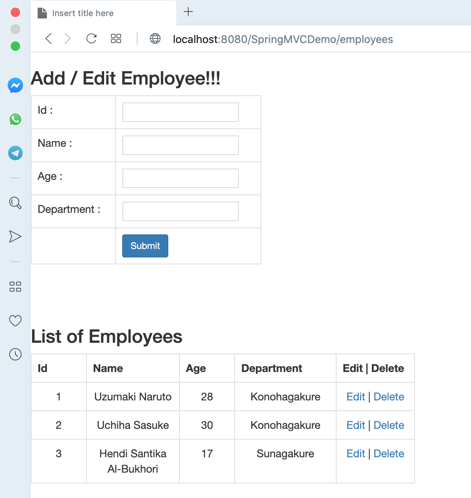
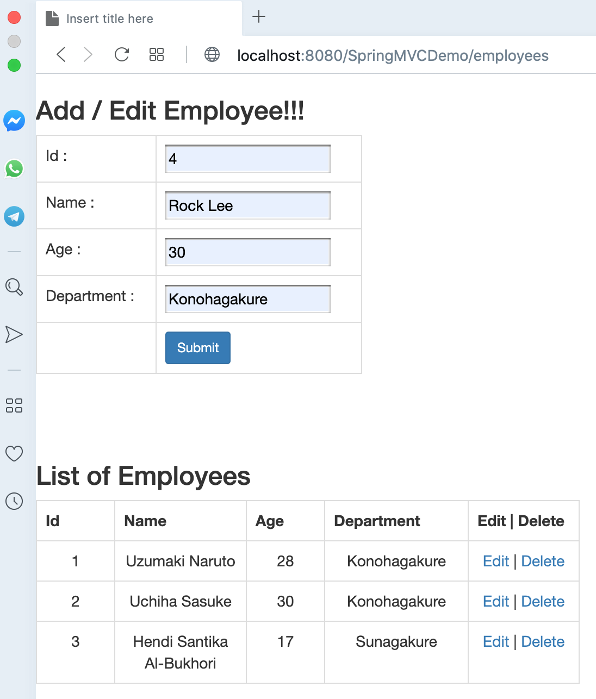
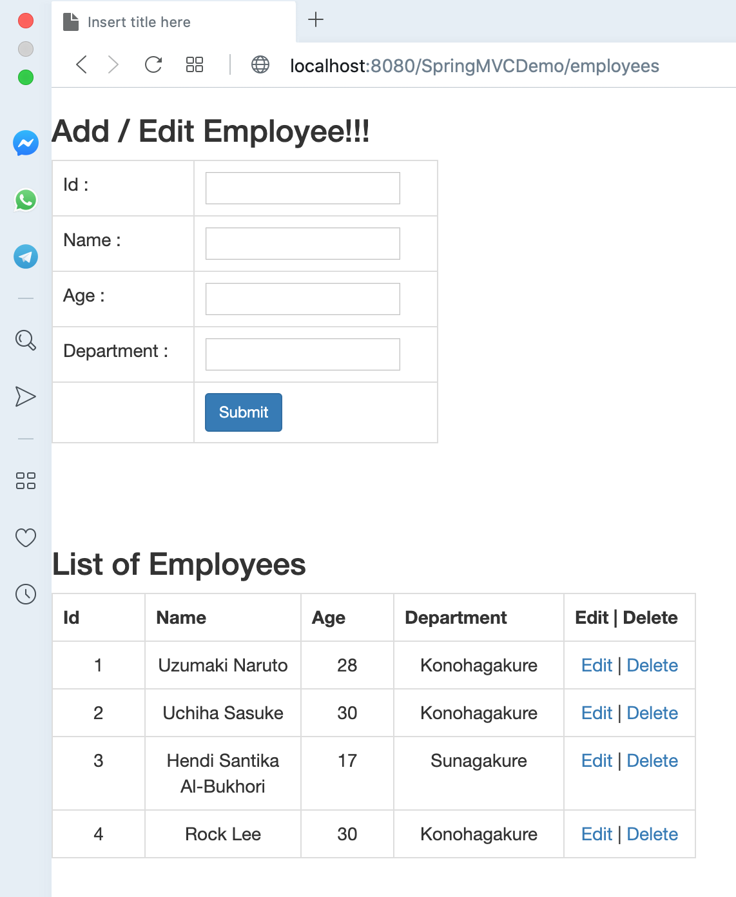

# SpringMVCDemo

## Spring MVC CRUD Demo

## Things To Do

1. Clone this repository: `git clone https://github.com/hendisantika/SpringMVCDemo.git`
2. Go To folder: `cd SpringMVCDemo`
3. Run schema.sql script on your MySQL database console.
4. Package the application: `mvn clean package`
5. Deploy war file into Tomcat Server.
6. Open your favorite browser: http://localhost:8080/SpringMVCDemo/employees

## Screen shot

Index Page

Add New Employee Page

List All Employees

